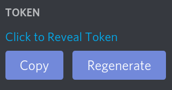

<h1 align="center">AwesomeSciBo</h1>

A simple Discord bot that automatically generates Science Bowl rounds using the ScibowlDB API!

## Deployment
Deploying this bot to your Discord server is relatively simple: you can add it to your own server by using [this link](http://scibot.adawesome.tech/).

## Contributing
Please see [the wiki](https://github.com/ADawesomeguy/AwesomeSciBo/wiki/contributing) contributing page.

## Installation
Please see [the wiki](https://github.com/ADawesomeguy/AwesomeSciBo/wiki/installation) install page.

## Usage
This bot uses slash commands now :). You can just click on the bot icon after typing `/` to see a list of commands.

## Notes
### Creating a Discord Application/Bot
To create your own application and bot using the [Discord Developer Portal](https://discord.com/developers), go to the previous link and sign in. Then create a new application, and click bots on the left. Configure it to your liking, and then copy the token.

   

That's the most important part of your bot *and don't share it with anyone*.

## Credit
The bot was made by [@ADawesomeguy](https://github.com/ADawesomeguy). However, the API was made by [@CQCumbers](https://github.com/CQCumbers). Go give [his API](https://github.com/CQCumbers/ScibowlDB) a star, he totally deserves it!
